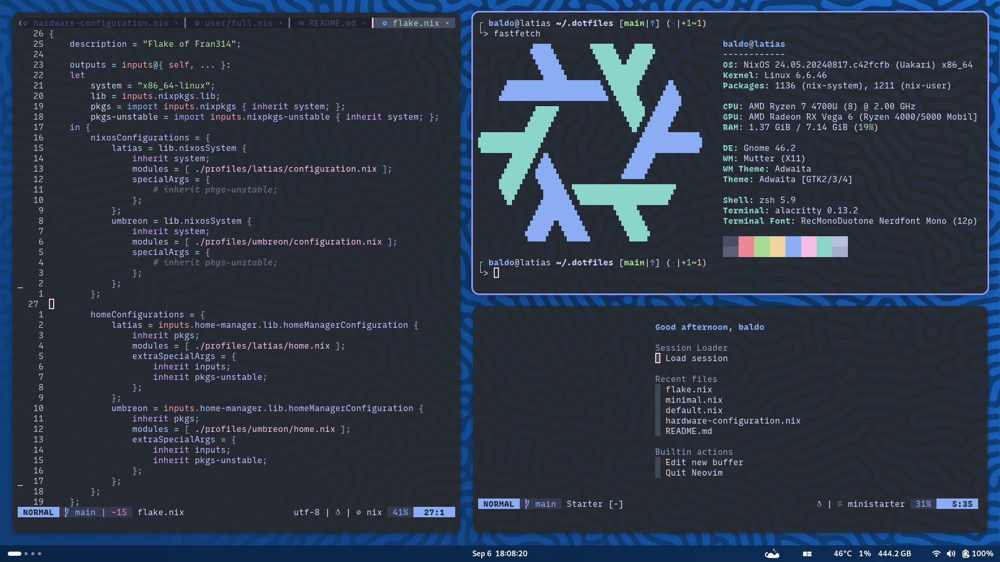

# My NixOS configuration

This repo contains my multi-profile NixOS configuration.

This configuration is still a work in progress and I wouldn't consider it ready
for use, but it can be taken as an example on how to structure a NixOS
configuration.

## Installation

> [!NOTE]  
> I'm not 100% sure that this is the correct way to install a NixOS
> configuration from github, but it is what I am using. If you know of a better
> way (mainly, how to handle the hardware-configuration and bootloader
> configurations) please let me know.

### Install default NixOS image

First, install NixOS on the desired machine via a
[installer ISO](https://nixos.org/download/#nixos-iso) (for your own sake, use
the Graphical ISO image, as this choice still allows you to use a
desktop-environment-less profile, and it's much easier to use).

For this installation, install with Swap (with Hibernate) and set Allow Unfree
Software to true.

(This installation might get stuck at 46%. It happens, and it takes A LOT to
finish. Just make the logs visible next to the progress bar to make sure that
something is actually happening)

### Apply profile

With NixOS installed, you should have your own version of `configuration.nix`
and `hardware-configuration.nix` stored in `/etc/nixos`. These are created by
NixOS for you own hardware specifically, and will be used to fine tune the
profile of your choice from this configuration

Clone this repo to `~/.dotfiles` with

```bash
git clone https://github.com/Fran314/nixos.git ~/.dotfiles
```

Then, in the `~/.dotfiles/profiles` directory, copy the profile directory of
your choice, so to have a clone that you can edit to adapt to your hardware.

In the cloned profile directory, copy your version of
`hardware-configuration.nix` (the one from `/etc/nixos`) to adapt the profile to
your specific hardware.

> [!IMPORTANT]  
> Cloning `hardware-configuration.nix` might not be enough! `configuration.nix`
> might also contain configurations relevant to your specific setup, such as the
> location of the boot partition.
>
> It's important that you check your `/etc/nixos/configuration.nix` for these
> settings and that you copy them into the `configuration.nix` of the profile
> you cloned. In particular, pay attention to the following settings:
>
> -   `boot.loader.*` for the boot loader location and type
> -   `networking.hostName` for the hostname of the machine (I guess this isn't
>     strictly necessary but it also isn't set anywhere else and you might want
>     to customise it)

Finally, edit the `flake.nix` file in the repo to add your new profile by
cloning the existing profile and changing the paths.

Then, update the system with

```bash
sudo nix-build switch --flake ~/.dotfiles#YOUR_PROFILE_NAME
home-manager switch --flake ~/.dotfiles#YOUR_PROFILE_NAME
```

## Post-installation

Despite NixOS being an 100% declarative OS, a couple of finalization steps are
required. It's a bit of a bummer, but they're the last imperative configuration
you'll ever have to do.

These operation might be necessary:

-   ~~change your user's password~~ (you probably already set your password
    during the NixOS installation),
-   copy your secrets to this machine (see `restore-secrets.sh`)
-   run `git remote set-url origin git@github.com:Fran314/nixos.git`

Additionally if you're running the **latias** profile (or a profile that uses
`user/full.nix`) you might want to

-   remove the unused version of the xdg-dirs (see `remove-old-xdg.sh`),
-   download the weekly build appimage for freecad and save it as
    `~/applications/FreeCAD.AppImage`
-   add the nvim-memo window to the floating exceptions for pop-shell

## Profiles

This configuration is structured around three profiles:

-   **latias**: this is the profile for my personal computer. It's supposed to
    be a full-featured environment intended for multiple possible uses, from
    simple daily browsing, to coding, 3D modeling and more,
-   **umbreon**: this is the profile for my homelab. It's supposed to be a
    CLI-only but comfortable environment, intended to be used for managing
    self-hosted applications via ssh.
