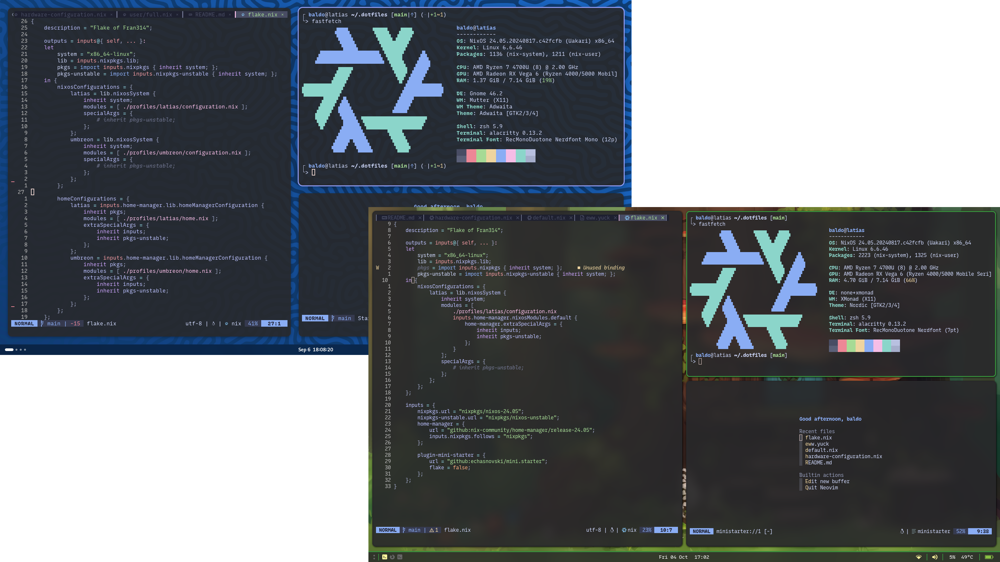

# Fran314's NixOS configuration

This repo contains my multi-profile NixOS configuration.

> [!NOTE]  
> This is not meant to be a general purpose configuration. You're free to take
> inspiration from it and use it as you like, but don't expect it to work on
> your machine out of the box without some serious tweaking

## Profiles

This configuration is structured around three profiles:

- `latias`: this is the profile for my laptop. It's supposed to be a
  full-featured environment intended for multiple possible uses, from simple
  daily browsing, to coding, 3D modeling and more,
- `kyogre`: this is the profile for my desktop. Its main use is gaming with
  games that wouldn't run on the laptop. It inherits much of its configuration
  from `latias`, mainly for convenience of having the same setup
- `umbreon`: this is the profile for my homelab. It's supposed to be a CLI-only
  but comfortable environment, intended to be used for managing self-hosted
  applications via ssh.
- `altaria`: this is the profile for an Hetzner VPS. It's meant to be as
  lightweight as possible (given the 40GB disk limit), and has no access to any
  secret since it's considered untrusted. Its installation differs from the
  other profiles.

## Installation

Different profiles require slightly different installation processes. They are
all documented in the dedicated READMEs:

- [latias' README](/profiles/latias/README.md)
- [kyogre's README](/profiles/kyogre/README.md)
- [umbreon's README](/profiles/umbreon/README.md)
- [altaria's README](/profiles/altaria/README.md)
